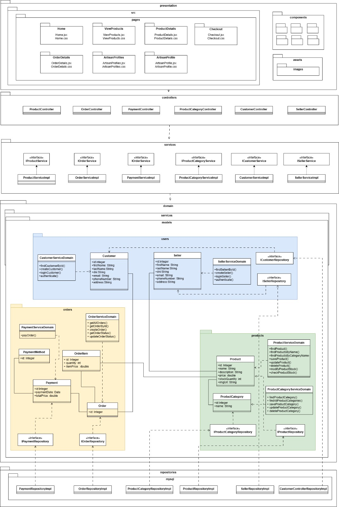

## Ecommerce API
**Curso:**  Taller de Construcción de Software Web  
**Ciclo:** 2025-0  
**Profesor:** Sarmiento Calisaya, Edgar

### Integrantes ###
- Guia Muñoz, Wilfredo
- Ccora Quispe, Holiver Jhunior
- Collachagua Poma, Airton
- Escudero Principe, Álvaro
- Balceda Delgado, Mariana Alejandra
- Sifuentes Castillo, Luis
- Cumpa Pareja, Santiago
- Tupac Agüero, Kevin

## Índice
1. [Propósito](#propósito)
2. [Vista General de Arquitectura](#vista-general-de-arquitectura)
3. [Principales Servicios REST y Funcionalidades](#principales-servicios-rest-y-funcionalidades)
   - [📦 Módulo: Product Controller](#-módulo-product-controller)
   - [🏷️ Módulo: Product Category Controller](#-módulo-product-category-controller)
4. [📄 Modelos: Entidades y Agregados](#-modelos-entidades-y-agregados)
5. [Prácticas de Desarrollo](#prácticas-de-desarrollo)
   - [Construcción Automática](#-construcción-automática)
   - [Análisis Estático](#-análisis-estático)
   - [Pruebas Unitarias](#-pruebas-unitarias)
   - [Pruebas de APIs](#-pruebas-de-apis)
6. [Gestión de Proyecto: Trello](#gestión-de-proyecto-trello)

### Propósito ###
Desarrollar un backend escalable y seguro para un ecommerce dirigido al sector de artesanos, facilitando la gestión de productos, pedidos y pagos, optimizando la visibilidad y comercialización de sus creaciones mediante una plataforma eficiente y accesible.

### Vista General de Arquitectura ###

### Principales Servicios REST y Funcionalidades ###

#### 📦 Módulo: **Product Controller** ####
**Propósito**: Gestión de productos en el sistema.

#### 🔹 Operaciones disponibles: ####
| Método  | URL | Parámetros |
|---------|--------------------------------|-------------------------|
| **PUT** | `/api/products/updateStock/{id}/{quantity}` | `id` (identificador del producto), `quantity` (cantidad a actualizar) |
| **PUT** | `/api/products/update/{id}` | `id` (identificador del producto) |
| **POST** | `/api/products/save` | Cuerpo de la solicitud con los datos del producto |
| **GET** | `/api/products/{id}` | `id` (identificador del producto) |
| **GET** | `/api/products/name/{name}` | `name` (nombre del producto) |
| **GET** | `/api/products/category/{id}` | `id` (identificador de la categoría) |
| **GET** | `/api/products/all` | - |
| **DELETE** | `/api/products/delete/{id}` | `id` (identificador del producto) |

---

#### 🏷️ Módulo: **Product Category Controller** ###
**Propósito**: Gestión de categorías de productos.

#### 🔹 Operaciones disponibles: ####
| Método  | URL | Parámetros |
|---------|--------------------------------|-------------------------|
| **PUT** | `/api/categories/update/{id}` | `id` (identificador de la categoría) |
| **POST** | `/api/categories/save` | Cuerpo de la solicitud con los datos de la categoría |
| **GET** | `/api/categories/{id}` | `id` (identificador de la categoría) |
| **GET** | `/api/categories/all` | - |
| **DELETE** | `/api/categories/delete/{id}` | `id` (identificador de la categoría) |

---

#### 📄 Modelos: Entidades y Agregados ####
Los siguientes modelos son utilizados en los servicios REST:

- **`ProductRequest`**: Representa la solicitud para crear o actualizar un producto.
- **`ProductResponse`**: Respuesta con la información de un producto.
- **`ProductCategoryRequest`**: Representa la solicitud para crear o actualizar una categoría de producto.
- **`ProductCategoryResponse`**: Respuesta con la información de una categoría de producto.

### Prácticas de Desarrollo ###

####  Construcción Automática ####
- La integración y despliegue continuo para Alpakitay se implementa utilizando Jenkins como herramienta de automatización y Maven como gestor de construcción del proyecto.
 

      
   

####  Análisis Estático ####
El análisis estático fue realizado para garantizar la calidad, seguridad y mantenibilidad del código del proyecto. Esto se implementó utilizando herramientas especializadas que nos ayudaron a identificar defectos en las etapas iniciales del desarrollo.
- Herramientas Utilizadas:
  - SonarQube: Para generar informes detallados sobre métricas de calidad y posibles errores en el código.
  - Jenkins: Integrado con SonarQube para automatizar el análisis estático dentro del pipeline de CI/CD.

      
   

####  Pruebas Unitarias ####
- Las pruebas unitarias garantizan que cada componente individual del sistema funcione correctamente de manera aislada.

      
   

      
   

####  Pruebas de APIs ####

      
   

      
   

### Gestión de Proyecto: Trello ###
- Para este proyecto, Trello se utiliza para organizar las tareas de desarrollo, pruebas y documentación. Se han creado tableros con listas para cada fase del proyecto, permitiendo un seguimiento claro del progreso, asignación de responsabilidades y control de pendientes de manera ágil y colaborativa.
- Link: https://trello.com/b/RrAADVMk/sistema-de-ventas-de-productos-artesanales 
  

      
   

